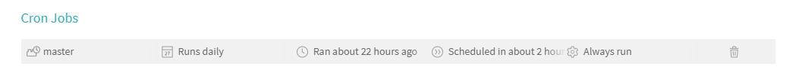

```{r setup, include=FALSE}
knitr::opts_chunk$set(echo = TRUE, eval = FALSE)
```

## Why?

```{r, echo = FALSE, eval = TRUE, out.width = '50%', fig.align = 'center'}
knitr::include_graphics("IMG_4034.JPG")
```

## Required Resorces

In order to build a data package for this presentation I needed the following:

- GitHub ([BenBarnard/dataPkgBuild](https://github.com/BenBarnard/dataPkgBuild))
- Travis
- Data access
- drat, and
- other packages as needed for data sourcing.

## Data package Build

Easy route:

- fork repository ([BenBarnard/dataPkgBuild](https://github.com/BenBarnard/dataPkgBuild))
- change r scripts as necessary to source data

Harder Route:

- setup package skeleton
- create "docs" or another folder to be added to .Rbuildignore
- create R scripts to source data to be added to .Rbuildignore
- create R script to deploy drat to be added to .Rbuildignore
- create R script to handle custom build options to be added to .Rbuildignore
- create .travis.yml

## Creating Package Skeleton

Setup GitHub repository by prefered method.

```{r}
library(usethis)

create_package(getwd())
use_travis()
```


## .travis.yml

```{yml}
language: R
sudo: false
script:
 - Rscript version_change.R
 - Rscript data_build.R
 - R CMD build .
 - R CMD check *tar.gz
cache: packages
after_success:
 - Rscript drat_deploy.R
deploy:
  provider: pages
  skip_cleanup: true
  github_token: $GITHUB_PAT
  on:
    branch: master
  local-dir: docs
  target-branch: gh-pages
```

## version_change.R

```{r}
d <- read.dcf('DESCRIPTION')
d[1,3] <- gsub('-', '.', Sys.Date())
write.dcf(d, 'DESCRIPTION')
```

## Package Dependecies in data_build.R

```{r}
install.packages(c("DBI", "nycflights13", "dplyr",
                   "RSQLite", "usethis", "httr",
                   "rjson", "tibble", "purrr",
                   "dbplyr"))

library(DBI)
library(nycflights13)
library(dplyr)
library(RSQLite)
library(usethis)
library(httr)
library(rjson)
library(tibble)
library(purrr)
```

## R script to build data from api

```{r}
payload <- list(
  'seriesid' = c('LAUCN040010000000005', 'LAUCN040010000000006'),
  'startyear' = 2010,
  'endyear' = 2012,
  'catalog' = FALSE,
  'calculations' = TRUE,
  'annualaverage' = TRUE)

response <- POST(
  url = "https://api.bls.gov/publicAPI/v1/timeseries/data/",
  body = toJSON(payload),
  content_type_json())

json <- fromJSON(rawToChar(response$content))
```

## R script to build data from api

```{r}
bls_test_df <- map_dfr(json$Results$series, function(x){
  cbind(tibble(seriesID = x$seriesID),
        map_dfr(x$data, function(y){
          tibble(year = y$year,
                 period = y$period,
                 periodName = y$periodName,
                 value = y$value,
                 footnotes = y$footnotes)
        })
  )
})

use_data(bls_test_df, overwrite = TRUE)
```

## R script to build from database

```{r}
con <- DBI::dbConnect(RSQLite::SQLite(), path = ":memory:")

copy_to(con, nycflights13::flights, "flights",
        temporary = FALSE,
        indexes = list(
          c("year", "month", "day"),
          "carrier",
          "tailnum",
          "dest"
        )
)

flights_db <- tbl(con, "flights")
```

## R script to build from database

```{r}
flights_sqldb_df <- collect(summarise(group_by(flights_db, dest),
                                      delay = mean(dep_time, 
                                                   na.rm = TRUE)))

use_data(flights_sqldb_df, overwrite = TRUE)
```

## drat_deploy.R

```{r}
install.packages('drat')
date <- gsub('-', '.', Sys.Date())
pkg <- paste0('dataPkgBuild_', date, '.tar.gz')
drat::insertPackage(pkg, repodir = 'docs')
```


## .Rbuildignore

I really don't want any annoying messages. The .Rbuildignore should include the directory and files:

- docs
- version_change.R
- data_build.R, and 
- deploy_drat.R.

```{.Rbuildignore}
^\.travis\.yml$
^dataPkgBuild\.Rproj$
^\.Rproj\.user$
^docs
drat_deploy.R
version_change.R
data_build.R
```


## Email notifications

Sometimes we don't want to tell people the new data is up (or talk to anybody at all).

```{yml}
notifications:
  email:
    - ben_barnard@outlook.com
  on_success: always
  on_failure: always
```

## Setting Cron Jobs

Before:
```{r, echo = FALSE, eval = TRUE, out.width = '100%'}

```


After:
```{r, echo = FALSE, eval = TRUE, out.width = '100%'}

```

## Questions?

```{r, echo = FALSE, eval = TRUE, out.width = '50%', fig.align = 'center'}

```


